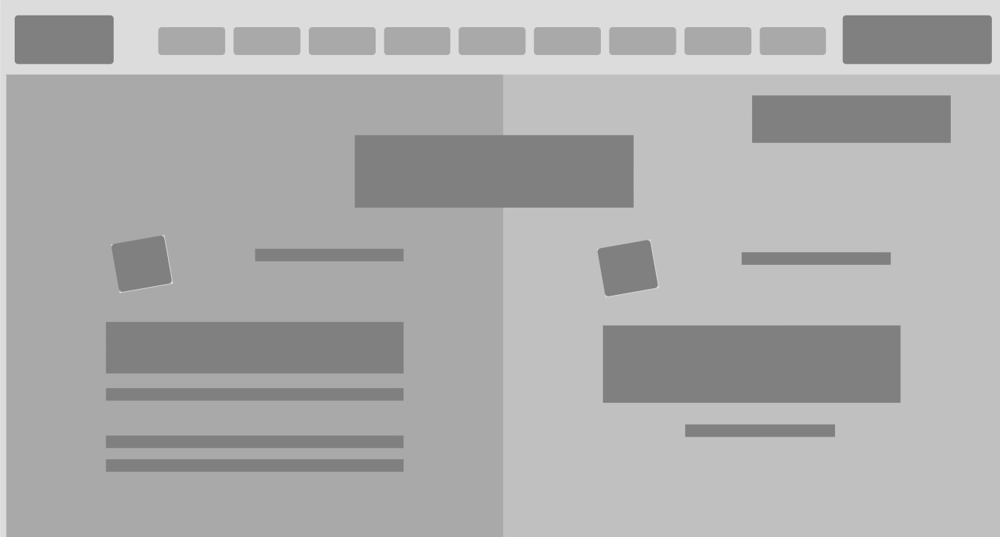

# DesignTeardown

This project is part from Microverse program, designed to learn to position things were we exactly want them. Made with HTML/CSS by Alan Solis and Adetola Adesuyi

## Design Teardown with the following features:

- Screen size of 1440px

- Navigation Bar with hovering effects

- Backgrounds features on all the project

- Flexbox, grid and floats.

- Articles.

## Built With

- HTML

- CSS/SCSS

## Live Demo

[Live Demo Link](https://rawcdn.githack.com/warblo001/DesignTeardown/ecc85f3b89fd94a88cd1bd7de6901886246b8ce0/index.html)

**See the page via the link above**

**See the Source Page via the link below**

[Source Page Link](https://www.smashingmagazine.com/)

## Authors

👤 **Adetola Adesuyi**

- GitHub: [@Arinpe](https://github.com/Arinpe)
- Twitter: [@_detola_](https://twitter.com/_detola_)
- LinkedIn: [LinkedIn](https://www.linkedin.com/in/adesuyi-adetola-7b4451111/)

👤 **Alan Solis**

- GitHub: [@github](https://github.com/warblo001)
- Twitter: [@twitter](https://twitter.com/Alan55572391)
- LinkedIn: [LinkedIn](https://www.linkedin.com/in/alan-solis-b567b044/)

## Show your support

Give a ⭐️ if you like this project!

## 📝 License

This project is [MIT](LICENSE) licensed.
